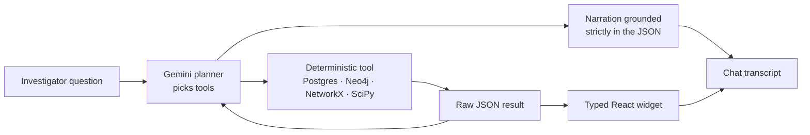
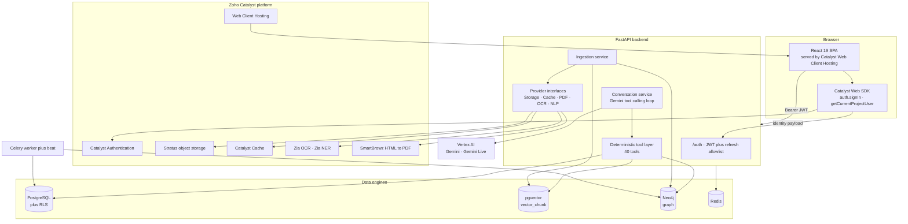
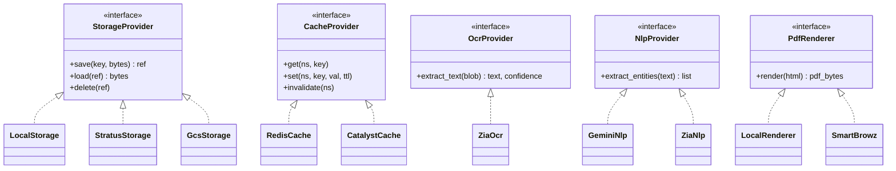
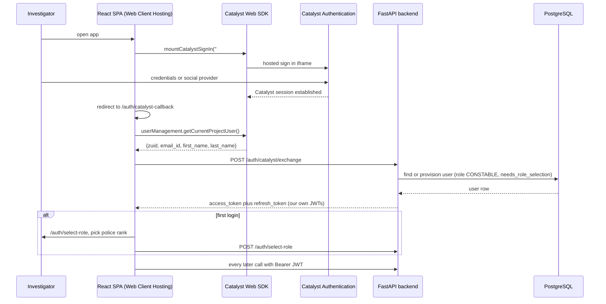
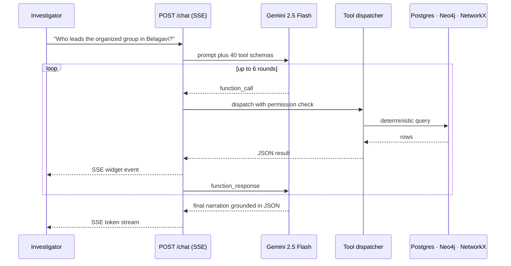
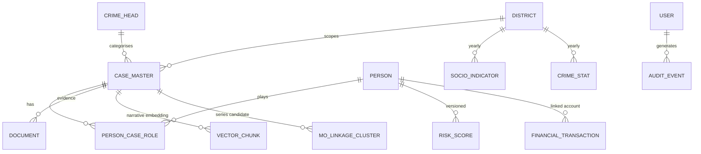
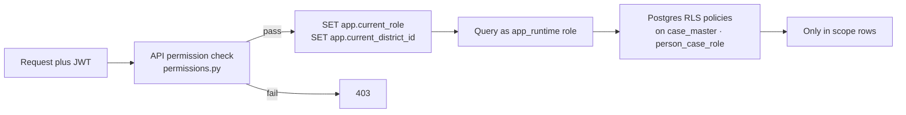
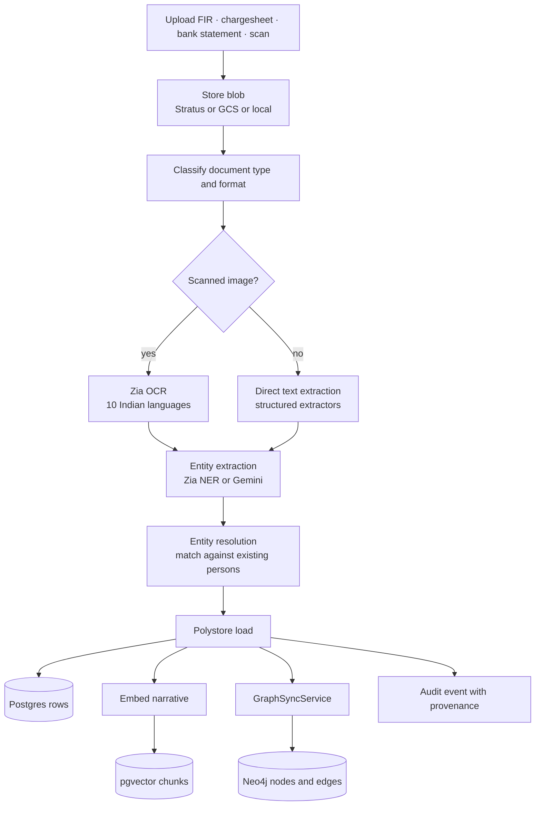
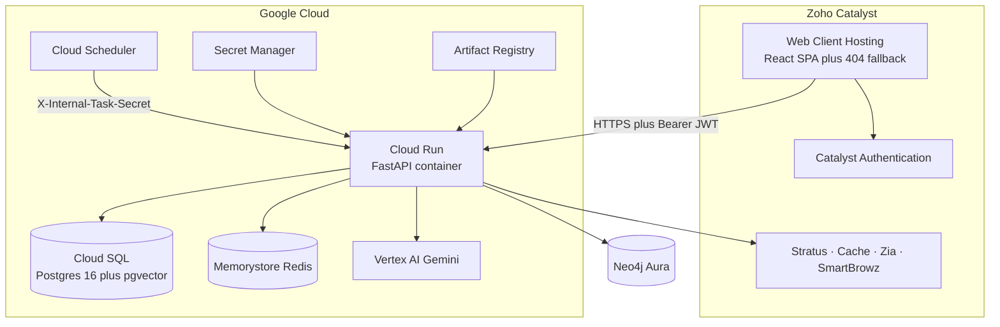

<div align="center">


### Karnataka Crime Intelligence Platform


*The model plans and narrates. Deterministic tools compute.*

<br/>

**Core**


**Data engines**


**AI and ML**


**Zoho Catalyst**


**Frontend**


**Infrastructure**


<br/>


</div>

---

An investigative intelligence platform for the Karnataka State Police that fuses three data engines
(relational, graph, vector), a deterministic analytics tool layer, and a conversational agent that can
only speak about numbers the tools actually computed. Built as a polyglot stack, deployed with a
**Zoho Catalyst** front door (Web Client Hosting plus Embedded Authentication) and a set of
**Catalyst-backed platform services** (Stratus object storage, Catalyst Cache, Zia OCR, Zia NER,
SmartBrowz PDF rendering) that sit behind swappable provider interfaces.

---

## Table of contents

1. [Core principle](#1-core-principle)
2. [Technology stack](#2-technology-stack)
3. [System architecture](#3-system-architecture)
4. [Zoho Catalyst integration](#4-zoho-catalyst-integration)
5. [The tool layer](#5-the-tool-layer-what-the-agent-can-actually-do)
6. [Conversational orchestration and widgets](#6-conversational-orchestration-and-widgets)
7. [Data architecture](#7-data-architecture-polystore)
8. [Security, RBAC and governance](#8-security-rbac-and-governance)
9. [Ingestion pipeline](#9-ingestion-pipeline)
10. [Analytics and ML engines](#10-analytics-and-ml-engines)
11. [Background jobs](#11-background-jobs)
12. [API surface](#12-api-surface)
13. [Frontend surface](#13-frontend-surface)
14. [Running it locally](#14-running-it-locally)
15. [Configuration reference](#15-configuration-reference)
16. [Deployment topology](#16-deployment-topology)
17. [Repository layout](#17-repository-layout)
18. [Known gaps and tradeoffs](#18-known-gaps-and-tradeoffs)

---

## 1. Core principle

> **The model plans and narrates. Deterministic tools compute.**

Every number the assistant reports (a PageRank score, a Hawkes forecast rate, a structuring alert, a
risk band, a GWR coefficient) is produced by fixed, versioned Python code and handed to the model as
JSON. The model chooses which tools to call, in what order, and writes prose around the result. It is
explicitly forbidden from inventing statistics, UUIDs or relationships, and when narration fails the
deterministic tool output and its widget still render. This is what makes the output defensible in an
investigative context rather than merely fluent.



---

## 2. Technology stack

### 2.1 Backend

| Layer | Choice | Notes |
|---|---|---|
| Language / runtime | Python 3.11 | |
| Web framework | FastAPI | Async throughout, OpenAPI at `/api/v1/docs` |
| ORM | SQLAlchemy 2.0 async | `asyncpg` driver, repository pattern in `app/repositories/` |
| Relational store | PostgreSQL 16 | Source of truth, Row Level Security enabled |
| Vector store | pgvector | 384 dimensional narrative embeddings, same Postgres instance |
| Graph store | Neo4j (async Bolt driver) | Co-offending, financial flow, predicted links |
| Cache | Redis, or **Catalyst Cache** | Selected by `CACHE_PROVIDER` |
| Task queue | Celery plus Redis broker | Beat for local, Cloud Scheduler in production |
| Planning / narration LLM | Vertex AI Gemini 2.5 Flash | `GEMINI_MODEL`, tool calling loop |
| Cheap second pass | Gemini 2.5 Flash Lite | `GEMINI_MODEL_FAST`, narration and claim validation |
| Duplex voice | Gemini Live native audio | WebSocket at `/chat/voice/live`, Kannada and English |
| Embeddings | `sentence-transformers/all-MiniLM-L6-v2` | Runs locally, no hosted embedding API |
| OCR | **Zia OCR** (default) | 10 Indian languages, handles scanned and handwritten FIRs |
| NER | Gemini, or **Zia Text Analytics** | Selected by `NLP_PROVIDER` |
| PDF rendering | xhtml2pdf local, or **SmartBrowz** | Selected by `PDF_PROVIDER` |
| Object storage | Local FS, **Catalyst Stratus**, or GCS | Selected by `STORAGE_PROVIDER` |
| Metrics | `prometheus-fastapi-instrumentator` | `GET /metrics` |

### 2.2 Frontend

| Layer | Choice |
|---|---|
| Framework | React 19 plus TypeScript |
| Build tool | Vite 8 |
| Routing | React Router 7, lazy loaded route modules |
| Server state | TanStack Query 5 |
| Styling | Tailwind CSS 4 plus Radix UI primitives (shadcn style component set) |
| Charts | Recharts |
| Network graph | `d3-force` custom force directed renderer |
| Maps | Leaflet plus React Leaflet |
| Forms | React Hook Form plus Zod |
| i18n | i18next plus react-i18next, English / Hindi / Kannada |
| Auth SDK | **Zoho Catalyst Web SDK 4.4.0** (`catalystWebSDK.js` plus `/__catalyst/sdk/init.js`) |
| Lint | oxlint |

### 2.3 Infrastructure

| Concern | Local | Deployed |
|---|---|---|
| Frontend hosting | Vite dev server, or nginx container | **Catalyst Web Client Hosting** |
| Sign in | Email plus simulated OTP | **Catalyst Embedded Authentication** |
| Backend | Docker Compose service | Cloud Run container |
| Postgres plus pgvector | `pgvector/pgvector` container | Cloud SQL for PostgreSQL 16 |
| Neo4j | `neo4j` container with GDS plugin | Neo4j Aura or a VM |
| Cache | Redis container | Memorystore, or Catalyst Cache |
| Scheduled work | Celery Beat | Cloud Scheduler hitting `/internal/tasks/*` |
| Blobs | Docker volume | Catalyst Stratus or GCS bucket |

---

## 3. System architecture



---

## 4. Zoho Catalyst integration

Catalyst is used in two distinct ways, and it is worth separating them because they have different
failure modes:

1. **As the application front door.** The SPA is served by Catalyst Web Client Hosting and signs users
   in with Catalyst Embedded Authentication. This is not optional at deploy time; it is how a user
   reaches the product.
2. **As a set of platform services behind provider interfaces.** Storage, cache, OCR, NER and PDF
   rendering each have a `Provider` base class, a local implementation, and a Catalyst implementation.
   A one line `.env` flip picks one. No call site changes.

### 4.1 Catalyst services in use

| Catalyst service | What it does here | Code | Selected by |
|---|---|---|---|
| **Web Client Hosting** | Serves the built SPA, provides `/__catalyst/sdk/init.js`, owns `homepage`, `login_redirect` and the `404.html` SPA fallback | `frontend/public/client-package.json` | Deploy target |
| **Embedded Authentication** | Hosted sign in iframe (email plus social providers), project user directory | `frontend/src/lib/catalyst/catalystAuth.ts`, `CatalystCallbackPage.tsx` | Deploy target |
| **Stratus** | Object storage for uploaded documents, generated reports and audio blobs, S3 style PUT/GET/DELETE on a per bucket domain | `app/core/storage/stratus.py` | `STORAGE_PROVIDER=catalyst_stratus` |
| **Cache** | Graph query result cache with version counter invalidation | `app/core/cache/catalyst_cache.py` | `CACHE_PROVIDER=catalyst` |
| **Zia OCR** | Scanned image and handwriting to text, 10 Indian languages, used on scanned Kannada FIRs | `app/core/ocr/zia.py` | `OCR_PROVIDER=zia` (default) |
| **Zia Text Analytics NER** | Named entity extraction from narrative text during ingestion | `app/core/nlp/zia_nlp.py` | `NLP_PROVIDER=zia` |
| **SmartBrowz** | Real headless Chromium HTML to PDF for case reports and chat transcript exports | `app/core/pdf/smartbrowz.py` | `PDF_PROVIDER=smartbrowz` |
| **AppSail** (kept, not active) | Per request end user verification via platform injected `X-ZC-*` headers | `app/core/catalyst_request_auth.py` | Dormant, see §18 |

### 4.2 The provider abstraction



Every Catalyst adapter talks **REST plus OAuth**, not the `zcatalyst-sdk`. The SDK only
self-authenticates when the process is running inside Catalyst, so a SDK based adapter would work on
AppSail and nowhere else. REST plus a shared OAuth token manager (`app/core/catalyst_auth.py`, refresh
token to cached access token) means the exact same adapter code runs from a laptop, from Docker
Compose, from Cloud Run and from AppSail.

### 4.3 OAuth scopes on the self client token

| Scope | Used by |
|---|---|
| `Stratus.*`, `ZohoCatalyst.buckets.*` | Stratus storage adapter |
| `cache.*`, `segments.ALL` | Catalyst Cache adapter |
| `mlkit.READ` | Zia OCR and Zia NER |
| `pdfshot.execute`, `dataverse.execute` | SmartBrowz PDF rendering |

Data centre is India (`accounts.zoho.in`, `api.catalyst.zoho.in`), set with `CATALYST_DC=in`.

### 4.4 Sign in flow



Catalyst owns credential verification. It does **not** own authorization: Catalyst roles cannot express
a seven rank police RBAC with district scoping, so after exchange the platform issues its own JWT and
every downstream route is gated by the capability matrix in `app/core/permissions.py`.

### 4.5 Catalyst Cache specifics

Catalyst Cache is not Redis and the adapter is written around the differences:

| Constraint | Handling |
|---|---|
| No prefix scan or wildcard delete | Namespace plus **version counter** invalidation, bump the counter and every old key becomes unreachable |
| `expiry_in_hours` accepted range is 1 to 48 | TTL clamped into range before the call |
| `cache_name` length limit around 50 characters | Long keys hashed to a 40 character digest |
| No dedicated UPDATE scope | POST used as an upsert |
| Segment id required | Auto discovered on first use |

This is the cache in front of Neo4j graph queries, so endpoints like `/network/co-offending` run
through it end to end.

### 4.6 Web Client Hosting deploy notes

`frontend/public/client-package.json` is the deployment manifest:

```json
{
  "name": "karnataka-crime-intelligence-platform",
  "homepage": "index.html",
  "login_redirect": "index.html",
  "404": "404.html"
}
```

Three traps worth recording, all of which show up as a blank page or a redirect loop rather than an
error:

| Trap | Symptom | Fix in this repo |
|---|---|---|
| SPA deep links 404 | `/cases/:id` reloads to a Catalyst 404 page | `npm run build` copies `dist/index.html` to `dist/404.html`, and `404.html` is declared in the manifest |
| `homepage` resolves to a real file | Router receives `/index.html`, no route matches | Explicit `<Route path="/index.html">` redirect in `router.tsx` |
| SDK loaded outside Catalyst hosting | `window.catalyst` exists but has no project config, `signIn` fails silently inside its own iframe | `<script src="/__catalyst/sdk/init.js" onerror="window.__catalystInitFailed = true">` and `catalystAuth.ts` checks that flag before mounting |

---

## 5. The tool layer (what the agent can actually do)

Forty deterministic tools are registered. Each has a JSON schema, a Python implementation, an
execution backend, and (for most) a typed React widget. Tools that need an identifier are documented to
force a resolver tool first, so the model never guesses a `district_id`, `crime_head_id`, `person_id`
or account number.

### 5.1 Entity resolution tools

| Tool | Purpose | Backend | Widget |
|---|---|---|---|
| `search_persons` | Resolve a spoken name to a `person_id` with ILIKE partial match | Postgres | `person_search_results` |
| `get_districts` | Every Karnataka district with id, code and latest stress, literacy, unemployment, urbanization readings | Postgres | `district_list` |
| `get_crime_heads` | Every crime category with id and name | Postgres | `crime_head_list` |

### 5.2 Network analysis tools

| Tool | Purpose | Backend | Widget |
|---|---|---|---|
| `get_graph_subset` | Filtered subgraph across the whole network by node label, edge type, district, crime number, date range, or centred on one person at depth N | Neo4j | `force_directed_graph` |
| `get_ego_network` | Neighbourhood of one person to a given depth | Neo4j | `force_directed_graph` |
| `detect_communities` | Louvain community detection over the co-offending projection | NetworkX | `force_directed_graph` |
| `compute_centrality` | PageRank (likely operational leader) and betweenness (broker bridging two groups) | NetworkX | `centrality_scores` |
| `get_predicted_links` | Plausible but unconfirmed edges from the link prediction model, always labelled as a lead | Neo4j | `predicted_links` |
| `get_multi_jurisdiction_offenders` | Persons accused across more than one police unit, a mobility and organization signal | Postgres plus Neo4j | `multi_jurisdiction_offenders` |
| `get_mo_linkage_clusters` | Candidate same offender crime series grouped by modus operandi similarity | Postgres | `mo_linkage_clusters` |

### 5.3 Financial crime tools

| Tool | Purpose | Backend | Widget |
|---|---|---|---|
| `get_financial_accounts` | Entry point for any financial question about a person: real account numbers, activity counts, existing typology flags | Postgres | `financial_accounts_list` |
| `detect_financial_structuring` | Repeated sub threshold transfers between the same pair inside a rolling 7 day window (smurfing) | Postgres | `flow_diagram` |
| `detect_funnel_account` | Multi source inflow burst into a dormant account followed by rapid near total outflow (mule pattern) | Postgres | `flow_diagram` |
| `detect_financial_cycles` | Circular money movement, `MATCH path = (a)-[:TRANSACTED_WITH*2..6]->(a)` (layering) | Neo4j | `flow_diagram` |
| `detect_organized_clusters` | Louvain over already flagged accounts to surface coordinated groups | NetworkX | `flow_diagram` |
| `run_financial_scan` | All four typologies over an account list in one pass | Postgres plus Neo4j | `flow_diagram` |

### 5.4 Forecasting and risk tools

| Tool | Purpose | Backend | Widget |
|---|---|---|---|
| `forecast_hotspots` | Hawkes / ETAS per cell predicted rate, split into `background_component` (chronic socio-economic baseline) and `near_repeat_component` (acute recent spike) | NumPy plus SciPy | `hotspot_map` |
| `get_surveillance_priorities` | Top N forecast cells ranked as checkpoints with chronic versus acute breakdown, explicitly not a patrol roster | NumPy plus SciPy | `surveillance_priorities` |
| `get_temporal_trends` | Day of week and monthly seasonality from real case dates, plus hour of day **with an honest coverage percentage** because most historical cases have no recorded time | Postgres | `temporal_trends` |
| `compute_risk_score` | CHI weighted composite risk for an accused person | Postgres plus Neo4j | `risk_profile_card` |

### 5.5 Sociological and policy tools

| Tool | Purpose | Backend | Widget |
|---|---|---|---|
| `get_socio_indicators` | District year literacy, unemployment, urbanization, sex ratio, composite stress index | Postgres | `socio_trend` |
| `get_crime_stats` | Aggregate district year crime head counts, raw and CHI weighted | Postgres | `crime_stats_trend` |
| `get_socio_correlations` | Statewide Pearson r and p value between socio-economic factors and crime, raw counts versus CHI weighted harm | SciPy | `socio_correlation_matrix` |
| `get_gwr_coefficients` | Latest geographically weighted regression run for one district | Postgres | `gwr_coefficients` |
| `get_gwr_map` | Latest GWR coefficients for every district plus centroids, statewide map view | Postgres | `gwr_map` |
| `get_victim_demographics` | Age cohort, gender and crime category breakdown, aggregate only, never individual victim records | Postgres | `victim_demographics` |
| `get_urbanization_impact` | Urbanization growth versus crime velocity per district (Social Disorganization Theory) | Postgres | `urbanization_impact` |
| `get_policy_recommendations` | Priority ranked preventive recommendations with theoretical grounding and expected impact, driven by real district readings | Postgres | `policy_recommendations` |
| `calculate_police_staffing` | Recommended active staffing and patrol vehicle allocation from crime volume plus socio-economic stress | Postgres | `police_staffing_recommendation` |

### 5.6 Case and document tools

| Tool | Purpose | Backend | Widget |
|---|---|---|---|
| `get_case_workspace` | Whole case in one view: FIR core fields, suspects, witnesses, evidence, status timeline, masked per requester permissions | Postgres | `case_workspace` |
| `generate_case_brief` | One click investigator brief for a case | Postgres plus Gemini | `case_timeline` |
| `extract_document_text` | OCR or text extraction of an already uploaded document | **Zia OCR** | none |
| `extract_entities` | Named entities from a block of text | **Zia NER** or Gemini | `entities_list` |
| `get_active_alerts` | Standing early warning alerts: repeat offender, organized group, emerging hotspot, financial | Postgres | `alerts_list` |

### 5.7 Tool usage discipline

The rules encoded in the tool descriptions themselves, not just in the system prompt:

| Rule | Enforced by |
|---|---|
| Never guess a `person_id` | `search_persons` description says resolve first |
| Never guess a `district_id` or `crime_head_id` | `get_districts` and `get_crime_heads` are named as prerequisites in every consuming tool |
| Never guess an account number | `get_financial_accounts` is named as the mandatory first call for every financial detector |
| Predicted links are leads, never confirmed edges | Tool description plus a distinct dashed rendering in the graph widget |
| Hour of day statistics must cite coverage | Coverage percentage returned in the payload and required by the description |
| Surveillance priorities are a ranking, not a roster | Description explicitly denies that named officer scheduling data exists |
| Socio-economic indicators are place level | Descriptions state place level only, never tied to an individual, which is the ecological fallacy wall |

---

## 6. Conversational orchestration and widgets



| Aspect | Behaviour |
|---|---|
| Transport | Server Sent Events on `POST /chat`, `widget` events interleaved with text tokens |
| Tool rounds | Capped at 6, with a fallback narration path if the cap is exhausted |
| Widget mapping | `_map_to_widget` in `conversation_service.py`, tool name to widget type |
| Empty results | No widget is emitted for `None`, `[]` or `{}`, an empty frame containing `null` is not a visualization |
| Voice in | `POST /chat/voice` for transcription, `WS /chat/voice/live` for full duplex Gemini Live native audio |
| Transcript export | `POST /chat/export` renders the conversation to PDF, through SmartBrowz when enabled |
| Degraded mode | If narration fails, tool JSON and widgets still render, with an explicit AI unavailable state |

The frontend `ChatWidgetRenderer.tsx` type guards every payload before rendering, so a malformed or
unexpected tool result degrades to text instead of crashing the transcript.

---

## 7. Data architecture (polystore)



| Store | What lives there | Why not somewhere else |
|---|---|---|
| **PostgreSQL** | Cases, persons, roles, documents, transactions, districts, socio indicators, crime stats, users, audit, change history, risk scores, MO clusters | Source of truth, transactional integrity, and RLS gives a second isolation layer the API layer cannot bypass |
| **pgvector** | `vector_chunk`, 384 dimensional narrative embeddings, ivfflat / HNSW index | Similar case retrieval is a nearest neighbour problem, and colocating with Postgres avoids a fourth service |
| **Neo4j** | `Person`, `Incident`, `Account` nodes, `ACCUSED_IN`, `VICTIM_IN`, `WITNESSED`, `ASSOCIATED_WITH`, `TRANSACTED_WITH`, `PREDICTED_LINK` edges | Variable depth traversal and cycle detection, which recursive SQL does badly and slowly |
| **Redis or Catalyst Cache** | Graph query results, Celery broker and result backend | Graph queries are expensive and repeat often across a session |

---

## 8. Security, RBAC and governance

### 8.1 Capability matrix, not a rank ladder

Seven roles, expressed as capabilities in `app/core/permissions.py`, because specialist roles cut
across the hierarchy rather than sitting inside it.

| Role | Representative capabilities | Notable denials |
|---|---|---|
| `CONSTABLE` | View cases in own district, view hotspot trends | No unmasked PII, no network |
| `INSPECTOR` | Sensitive case view, unmasked PII, basic ego network, AI case brief | No financial crime data |
| `DSP` | Case editing, document promotion, advanced network, risk scoring, financial crime | |
| `SP` | Everything DSP has plus report sharing and audit log access | |
| `CRIME_ANALYST` | Analytics job management, GWR runs, financial crime, cross district analysis | Data steward, not a case owner |
| `POLICY_MAKER` | Aggregate trends, hotspots, socio insights, policy recommendations | **Blocked from individual case PII and networks**, the ecological fallacy wall |
| `DGP` | Full visibility plus user management | |

### 8.2 Two layer isolation



Two SQLAlchemy engines exist on purpose. The **admin engine** connects as the table owning superuser
and is used only for startup DDL. The **runtime engine** connects as a restricted `app_runtime` role,
because a superuser or table owner bypasses RLS entirely, which would turn every district isolation
policy into a silent no-op. `init_db()` creates that role and the policies automatically on first boot.

### 8.3 Governance features

| Feature | Implementation |
|---|---|
| Audit trail | Every login, logout, case view, brief generation, export, download, edit, upload and share, with user, IP, device and optional reason (`app/core/audit.py`), surfaced at `/admin/audit-log` |
| Immutable change history | SQLAlchemy event listener diffs direct edits to cases and persons (old value, new value, who, when), kept separate from versioned derived data |
| Optimistic concurrency | `version` field on cases, persons and notes, a stale write gets `409 Conflict` instead of silently clobbering a concurrent editor |
| MFA | Password plus OTP with a real refresh token allowlist, so logout actually revokes a session. Delivery is simulated under `ALLOW_MOCK_MFA`, and the app refuses to start with it enabled in production |
| Data masking | Named per field masking, never a generic mask everything helper, covering person identity and address fields plus the two explicitly sensitive columns (`religion_id`, `caste_id`) |
| Secure report sharing | Watermarked, optionally password protected PDFs with expiring and download limited share links |
| Password policy | 10 characters minimum, uppercase, digit and special character, validated at the Pydantic layer so failures return a clean 422 |
| Self registration | Always lands on `CONSTABLE`, role is never accepted from the caller |

---

## 9. Ingestion pipeline



Storage references are self describing so a blob is always traceable to its backend: `local://…`,
`seed://…`, `stratus://…`, `gcs://…`.

---

## 10. Analytics and ML engines

| Engine | File | Method |
|---|---|---|
| Network analysis | `services/analytics/network_analysis.py` | Neo4j traversal plus NetworkX PageRank, betweenness, Louvain. Deliberately GDS free so it runs on Aura free tier |
| Hawkes / ETAS forecast | `services/analytics/hawkes_forecast.py` | Self exciting point process, near repeat victimization, district socio-economic stress as a baseline rate modifier |
| Financial crime | `services/analytics/financial_crime.py` | Four typologies: structuring, funnel accounts, layering cycles, organized clusters |
| Risk profiling | `services/analytics/risk_profiling.py` | Composite of CHI weighted criminal history, network centrality, MO consistency, associate risk. Includes a fairness gate that returns 422 rather than scoring on unverified criminal history |
| GWR | `services/analytics/gwr.py` | `mgwr` locally varying coefficients per district using centroids, as a batch job |
| Temporal trends | `services/analytics/temporal_trends.py` | Hour, day of week and month aggregation with explicit coverage reporting |
| Socio insights | `services/analytics/socio_insights.py` | Pearson correlations, urbanization impact, victim demographics, policy recommendations |
| Early warning | `services/analytics/early_warning.py` | Standing alert scan for repeat offenders and dense co-offending communities |

### 10.1 Offline model pipeline

`ananya-work/` holds the trained model work, connected to the backend by `scripts/ml_bridge/`. The
bridge does not change the schema. It reads model output and writes into existing backend tables,
mapping the pipeline's TEXT ids to backend UUIDs deterministically with `uuid5` and tagging
`source_person_id` for traceability.

| Model | Method | Lands in | Surfaced by |
|---|---|---|---|
| Link prediction | node2vec plus logistic regression | Neo4j `PREDICTED_LINK` | `/network/predicted-links`, `get_predicted_links` |
| Risk scoring | Random survival forest | `risk_score` table | `/risk/{id}`, `compute_risk_score` |
| MO linkage | Siamese similarity model | `mo_linkage_cluster` table | `get_mo_linkage_clusters` |
| Graph metrics | PageRank, betweenness, community | Neo4j node properties | `compute_centrality`, `detect_communities` |

---

## 11. Background jobs

| Task | Trigger | What it does |
|---|---|---|
| `compute_centrality_scores` | Scheduled | Recompute PageRank and betweenness over the whole graph |
| `run_link_prediction` | Scheduled | Regenerate top N predicted links |
| `recompute_risk_scores_for_district` | Scheduled or on demand | Refresh risk scores after new case data |
| `recompute_district_stress_index` | Scheduled | Rebuild the composite socio-economic stress index |
| `compute_district_gwr` | Scheduled | Full GWR run across districts |
| `scan_early_warnings` | Scheduled | Repeat offender and organized group alert scan |
| `backfill_case_embeddings` | On demand | Embed case narratives into pgvector |

Locally these run under Celery Beat. On Cloud Run, Beat is replaced by Cloud Scheduler calling
`/api/v1/internal/tasks/*`, guarded by the `X-Internal-Task-Secret` header, whose default value the app
refuses to boot with in production.

---

## 12. API surface

Base prefix `/api/v1`. Interactive docs at `/api/v1/docs`.

| Router | Prefix | Responsibility |
|---|---|---|
| Authentication | `/auth` | Login, MFA challenge and verify, refresh, logout, `/catalyst/exchange`, `/select-role`, `/me` |
| Cases | `/cases` | List, detail, edit with optimistic concurrency, AI brief |
| Persons | `/persons` | Search, detail, associates |
| Documents and ingestion | `/documents` | Upload, OCR, classification, extraction |
| Network analysis | `/network` | Co-offending, ego, communities, predicted links, multi jurisdiction, graph subset |
| Crime patterns and trends | `/trends` | Hotspot forecast, temporal breakdown, surveillance priorities |
| Early warning alerts | `/alerts` | Standing alert feed |
| Model transparency | `/models` | Registered model cards, versions, provenance |
| Risk profiling | `/risk` | Compute and read risk scores |
| Financial crime | `/financial` | Accounts, structuring, funnel, cycles, clusters, full scan |
| Sociological insights | `/socio` | Indicators, correlations, GWR, demographics, policy recommendations |
| Conversational AI | `/chat` | SSE chat, voice transcription, live duplex voice WebSocket, transcript PDF export |
| Secure report sharing | `/reports` | Case report PDF export, share links |
| Investigator workspace | `/workspace` | Aggregated per case view |
| Administration | `/admin` | Users, role changes, deactivation, audit log, system jobs |
| Internal task triggers | `/internal/tasks` | Scheduler entry points, shared secret guarded |

---

## 13. Frontend surface

| Route | Page | Gate |
|---|---|---|
| `/login` | Sign in, Catalyst embedded or password plus OTP | Public |
| `/auth/catalyst-callback` | Exchanges Catalyst identity for platform tokens | Public |
| `/auth/select-role` | First login police rank selection | Authenticated, self guarded |
| `/access-scope` | Explains what each rank can see | Public by design, linked from sign in |
| `/` | Overview dashboard | Authenticated |
| `/cases`, `/cases/:caseId` | Case list and investigator workspace | Authenticated |
| `/persons`, `/persons/:personId` | Person search and profile | Authenticated |
| `/documents` | Upload and ingestion | `upload_document` |
| `/network`, `/network/graph` | Ego explorer and global force directed graph | `view_network_basic` |
| `/risk` | Risk profiling | Risk capability |
| `/financial` | Financial crime typology tabs | Financial capability |
| `/trends` | Hotspot map and temporal analytics | Authenticated |
| `/alerts` | Early warning feed | Authenticated |
| `/socio` | Sociological insights and policy recommendations | Authenticated |
| `/chat` | Investigator assistant with inline widgets and voice | Authenticated |
| `/admin/audit-log` | Audit trail | SP, DGP, Policy Maker |
| `/admin/users` | User management | `manage_users` |
| `/admin/jobs` | System job status | Analyst and above |

Every route module is lazy loaded, the whole UI is available in English, Hindi and Kannada, and the
Kannada build loads Noto Sans Kannada explicitly so glyphs render correctly.

---

## 14. Running it locally

`backend/` and `frontend/` are each self contained, with their own Dockerfile and env handling. The root
compose file only composes them together.

```bash
cp backend/.env.example backend/.env
```

Fill in at minimum `SECRET_KEY`, `POSTGRES_PASSWORD`, `POSTGRES_APP_PASSWORD`, `NEO4J_PASSWORD` and
`INTERNAL_TASK_SECRET`. None of these have insecure hardcoded fallbacks, the app refuses to start
without them.

```bash
docker compose up --build
```

This brings up Postgres with pgvector, Neo4j with the graph data science plugin, Redis, the API, the
Celery worker and beat, and an nginx served production build of the frontend. `init_db()` runs on API
startup and creates tables, applies numbered idempotent steps from `schema_upgrades.py`, creates the
restricted `app_runtime` role and installs the RLS policies.

Seed data:

```bash
docker compose exec api python -m scripts.seed_demo_data
```

```bash
docker compose exec api python -m scripts.seed_financial_transactions
```

```bash
docker compose exec api python -m scripts.embed_cases
```

Optional accuracy check against the labelled ground truth:

```bash
docker compose exec api python -m scripts.validate_financial_crime
```

### 14.1 Ports

| Service | Host port | Purpose |
|---|---|---|
| Frontend production build | 4173 | The app |
| Frontend dev server | 5173 | Vite with HMR, proxies `/api` to 8090 |
| Backend API | 8090 | REST plus Swagger at `/api/v1/docs` |
| Prometheus metrics | 8090 | `GET /metrics` |
| Postgres | 5432 | Relational and vector |
| Neo4j Bolt | 7687 | Graph queries |
| Neo4j Browser | 7474 | Manual graph inspection |
| Redis | 6379 | Cache and Celery |

### 14.2 Demo accounts

Seeded by `scripts/seed_demo_data.py`. Password comes from `SEED_DEMO_PASSWORD`, defaulting to
`Demo@12345` only if unset.

| Email | Role | Purpose |
|---|---|---|
| `admin@ksp.demo` | DGP tier admin | User management and audit monitoring |
| `dgp@ksp.demo` | DGP | Full visibility persona |
| `sp@ksp.demo` | SP | Sharing and audit persona |
| `dsp@ksp.demo` | DSP | Financial crime and risk persona |
| `inspector@ksp.demo` | Inspector | Bengaluru scoped |
| `constable@ksp.demo` | Constable | Bengaluru scoped, masked PII |
| `analyst@ksp.demo` | Crime Analyst | Analytics and GWR |
| `policymaker@ksp.demo` | Policy Maker | Aggregate only, blocked from case PII |

### 14.3 Frontend only development

```bash
cd frontend && npm install && npm run dev
```

Runs on 5173 and proxies `/api` to the backend on 8090, overridable with `VITE_API_PROXY_TARGET`.
`npm run build` type checks, builds, and copies `index.html` to `404.html` for the Catalyst SPA
fallback.

---

## 15. Configuration reference

### 15.1 Provider selection

| Variable | Values | Default | Effect |
|---|---|---|---|
| `STORAGE_PROVIDER` | `local`, `catalyst_stratus`, `gcs` | `local` | Where document, report and audio blobs live |
| `CACHE_PROVIDER` | `redis`, `catalyst` | `redis` | Graph query cache backend |
| `PDF_PROVIDER` | `local`, `smartbrowz` | `local` | Report and transcript PDF renderer |
| `OCR_PROVIDER` | `zia`, `local` | `zia` | Scanned document text extraction |
| `NLP_PROVIDER` | `gemini`, `zia`, `local` | `gemini` | Named entity extraction |

### 15.2 Catalyst credentials

| Variable | Purpose |
|---|---|
| `CATALYST_DC` | Data centre, `in` for India |
| `CATALYST_API_BASE` | Override the default `api.catalyst.zoho.<dc>` host |
| `CATALYST_PROJECT_ID` | Project id, `54726000000029001` for this project |
| `CATALYST_CLIENT_ID` / `CATALYST_CLIENT_SECRET` / `CATALYST_REFRESH_TOKEN` | Self client OAuth credentials for every REST adapter |
| `STRATUS_BUCKET` / `STRATUS_BASE_URL` | Bucket name and per bucket domain |
| `CATALYST_CACHE_SEGMENT` | Optional, auto discovered when blank |
| `SMARTBROWZ_PDF_URL` | Optional endpoint override |

### 15.3 Other required settings

| Variable | Why it matters |
|---|---|
| `SECRET_KEY` | JWT signing, no fallback |
| `POSTGRES_PASSWORD` | Superuser, DDL only |
| `POSTGRES_APP_PASSWORD` | The `app_runtime` role the API actually queries as, this is what makes RLS effective |
| `NEO4J_PASSWORD`, `NEO4J_DATABASE` | Aura instances sometimes name the database after the instance id, a mismatch silently queries the wrong database |
| `VERTEX_PROJECT_ID`, `GOOGLE_APPLICATION_CREDENTIALS` | Gemini and Gemini Live, service account needs `roles/aiplatform.user` |
| `INSTANCE_CONNECTION_NAME` | Set only on Cloud Run with an attached Cloud SQL instance, switches the DSN to the proxy Unix socket |
| `ALLOW_MOCK_MFA` | Must be false in production, the app refuses to start otherwise |
| `INTERNAL_TASK_SECRET` | Guards scheduler only endpoints, must be changed from the default in production |

---

## 16. Deployment topology



The split exists for one concrete reason. Catalyst AppSail caps container memory at 2 GB, and the image
carrying `torch`, `transformers` and `sentence-transformers` does not fit. Catalyst has no vector type,
no row level security and no graph engine, so pgvector, RLS and Neo4j have no native equivalent either.
Rather than rewrite the data layer onto Data Store and lose all three, the compute and the databases run
on GCP while Catalyst keeps everything it is genuinely better at: hosting, authentication, object
storage, cache, OCR, NER and PDF rendering. `backend/scripts/deploy_gcp.ps1` scripts the GCP half phase
by phase.

---

## 17. Repository layout

```
Datathon_KSP/
├── backend/
│   ├── app/
│   │   ├── api/v1/endpoints/      16 routers, one per domain
│   │   ├── core/
│   │   │   ├── catalyst_auth.py           shared OAuth token manager
│   │   │   ├── catalyst_request_auth.py   AppSail identity verification, dormant
│   │   │   ├── cache/                     base · redis · catalyst
│   │   │   ├── storage/                   base · local · stratus · gcs
│   │   │   ├── ocr/                       base · zia
│   │   │   ├── nlp/                       base · gemini · zia
│   │   │   ├── pdf/                       base · local · smartbrowz
│   │   │   ├── permissions.py             capability matrix
│   │   │   ├── database.py                admin engine plus RLS runtime engine
│   │   │   ├── audit.py · masking.py · change_tracking.py
│   │   │   └── vertex_ai_client.py
│   │   ├── models/                relational schema
│   │   ├── repositories/          data access
│   │   ├── services/
│   │   │   ├── analytics/         8 deterministic engines
│   │   │   ├── extraction/        classifier plus extractors
│   │   │   ├── conversation_service.py    tool registry plus orchestration loop
│   │   │   ├── ingestion_service.py
│   │   │   ├── graph_sync_service.py
│   │   │   └── report_service.py
│   │   └── tasks/                 Celery app and analytics tasks
│   └── scripts/
│       ├── ml_bridge/             model output to backend tables
│       ├── seed_demo_data.py · seed_financial_transactions.py
│       ├── embed_cases.py · validate_financial_crime.py
│       └── deploy_gcp.ps1
├── frontend/
│   ├── public/client-package.json Catalyst Web Client Hosting manifest
│   └── src/
│       ├── app/router.tsx         routes plus permission guards
│       ├── features/              13 feature areas
│       ├── components/charts/     graph, map and analytic widgets
│       └── lib/catalyst/          Catalyst Web SDK wrapper
├── ananya-work/                   offline model training and evaluation
├── docker-compose.yml
└── docs: ARCHITECTURE_AND_TECHNICAL_DETAILS.md · CATALYST_AND_ML_IMPLEMENTATION.md
        DEPLOYMENT_ZOHO_CATALYST.md · DATA_AND_TESTING_REQUIREMENTS.md · HOW_TO_RUN.md
```

---

## 18. Known gaps and tradeoffs

Stated plainly rather than buried, because each one is a deliberate decision with a documented reason.

| Gap | Why it exists | What closes it |
|---|---|---|
| `/auth/catalyst/exchange` trusts a client asserted identity | The mechanism that would verify it server side, `zcatalyst_sdk.initialize(req)` reading platform injected `X-ZC-*` headers, only works on AppSail, and the backend runs on Cloud Run | Move the backend back to AppSail and swap the endpoint to `get_catalyst_identity(request)`, the code is kept and working in `catalyst_request_auth.py` |
| Self service role selection after Catalyst signup | Catalyst roles cannot express police ranks, and manual admin promotion of every social login was not viable for a demo | Restrict `select_role` to low ranks, or require admin approval before `needs_role_selection` flips |
| Simulated MFA | No SMS or email provider wired in | Set `ALLOW_MOCK_MFA=false` and connect a real provider, production boot already refuses otherwise |
| No Alembic migrations | `create_all` plus numbered idempotent steps in `schema_upgrades.py` was enough while the schema moved fast | The `schema_version` table maps cleanly onto Alembic revisions |
| Geographic coordinates are synthetic | Deterministic Karnataka bounding box coordinates clustered per district, never real crime scene locations | Real geocoded FIR data |
| AppSail memory ceiling | 2 GB cap versus a torch bearing image | Swap `sentence-transformers` for `fastembed` ONNX, same model, roughly 200 MB, and drop unused heavy dependencies |

---

## Reference documents

| Document | Contents |
|---|---|
| `karnataka_crime_platform_design.md` | Full design record, schema of record for the crime domain data model |
| `ARCHITECTURE_AND_TECHNICAL_DETAILS.md` | Architecture deep dive |
| `CATALYST_AND_ML_IMPLEMENTATION.md` | Catalyst integration and ML bridge implementation record, with verification notes |
| `DEPLOYMENT_ZOHO_CATALYST.md` | Catalyst service mapping and the database strategy decision |
| `DATA_AND_TESTING_REQUIREMENTS.md` | Data requirements and test plan |
| `HOW_TO_RUN.md` | Step by step first run guide including WSL2 setup |
| `backend/scripts/FINANCIAL_CRIME_README.md` | Financial crime detector design and validation results |
